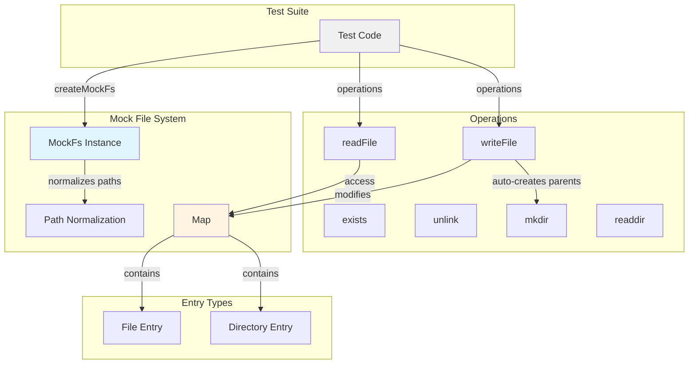
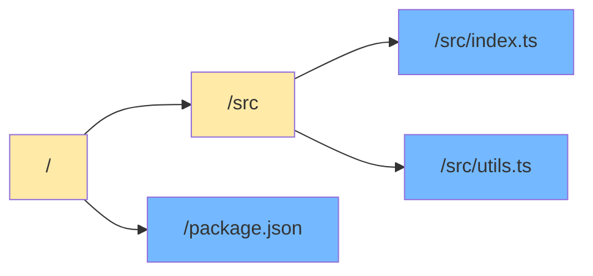
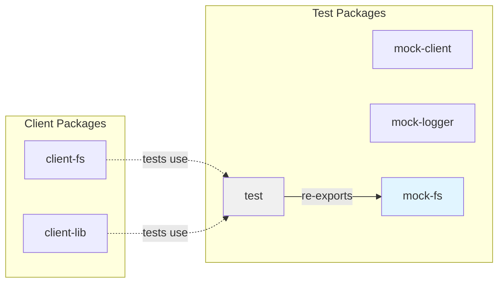

# @mark1russell7/mock-fs

[](https://www.npmjs.com/package/@mark1russell7/mock-fs)
[](https://www.typescriptlang.org/)
[](https://vitest.dev/)

In-memory file system mock for unit testing. Provides a lightweight, synchronous file system simulation that supports all common operations without touching the real disk.

## Overview

`@mark1russell7/mock-fs` enables testing of file system operations without side effects. It enables developers to:

- **Test file operations** in complete isolation without touching the real file system
- **Pre-populate files** and directories for test scenarios
- **Track modifications** with automatic timestamp updates
- **Verify file operations** by inspecting the internal store
- **Handle paths consistently** with automatic normalization (Windows/Unix)
- **Auto-create parent directories** when writing files

## Installation

```bash
npm install github:mark1russell7/mock-fs#main
```

## Architecture



### File System Structure



Directories (yellow) contain other entries, files (blue) contain string content.

## Quick Start

```typescript
import { describe, it, expect, beforeEach } from "vitest";
import { createMockFs, type MockFs } from "@mark1russell7/mock-fs";

describe("file operations", () => {
  let fs: MockFs;

  beforeEach(() => {
    fs = createMockFs({
      initialFiles: {
        "/config.json": '{"key": "value"}',
        "/src/index.ts": 'export const foo = "bar";',
      },
      initialDirs: ["/src", "/dist"],
    });
  });

  it("should read files", () => {
    const content = fs.readFile("/config.json");
    expect(content).toBe('{"key": "value"}');
  });

  it("should write files", () => {
    fs.writeFile("/output.txt", "Hello, World!");
    expect(fs.exists("/output.txt")).toBe(true);
    expect(fs.readFile("/output.txt")).toBe("Hello, World!");
  });

  it("should list directories", () => {
    const entries = fs.readdir("/src");
    expect(entries).toContain("index.ts");
  });
});
```

## API Reference

### Types

#### `MockFsEntry`
```typescript
interface MockFsEntry {
  type: "file" | "directory";      // Entry type
  content?: string | undefined;    // File content (only for files)
  mtime: Date;                     // Last modification time
}
```

Examples:
```typescript
// File entry
{
  type: "file",
  content: "console.log('Hello');",
  mtime: new Date("2025-01-15T10:30:00Z")
}

// Directory entry
{
  type: "directory",
  mtime: new Date("2025-01-15T10:00:00Z")
}
```

#### `CreateMockFsOptions`
```typescript
interface CreateMockFsOptions {
  initialFiles?: Record<string, string> | undefined;  // Path -> content mapping
  initialDirs?: string[] | undefined;                 // Directory paths to create
}
```

#### `MockFs`
```typescript
interface MockFs {
  // Direct access to the internal store
  files: Map<string, MockFsEntry>;

  // File operations
  readFile(path: string): string;                      // Read file content (throws if not found)
  writeFile(path: string, content: string): void;      // Write file (creates parents)
  exists(path: string): boolean;                       // Check if path exists
  unlink(path: string): void;                          // Delete file (throws if not found)

  // Directory operations
  mkdir(path: string, opts?: { recursive?: boolean }): void;  // Create directory
  readdir(path: string): string[];                     // List directory contents

  // Cleanup
  reset(): void;                                       // Clear all entries
}
```

### Factory Functions

#### `createMockFs(options?)`
Creates a new mock file system instance.

```typescript
function createMockFs(options?: CreateMockFsOptions): MockFs
```

**Parameters:**
- `options.initialFiles` - Pre-populate files as path/content pairs
- `options.initialDirs` - Pre-create directories

**Returns:** `MockFs` instance

**Example:**
```typescript
import { createMockFs } from "@mark1russell7/mock-fs";

// Empty file system
const fs = createMockFs();

// With initial structure
const fs = createMockFs({
  initialFiles: {
    "/package.json": '{"name": "my-app", "version": "1.0.0"}',
    "/src/index.ts": 'export const main = () => console.log("Hello");',
    "/README.md": "# My App",
  },
  initialDirs: ["/dist", "/node_modules"],
});
```

### Methods

#### readFile(path)

Read file contents. Throws if file doesn't exist.

```typescript
try {
  const content = fs.readFile("/config.json");
  console.log(content);
} catch (e) {
  console.error("File not found");
}
```

#### writeFile(path, content)

Write content to a file. Creates parent directories automatically.

```typescript
fs.writeFile("/deep/nested/file.txt", "content");
// Creates /deep and /deep/nested directories
```

#### exists(path)

Check if a path exists.

```typescript
if (fs.exists("/package.json")) {
  const content = fs.readFile("/package.json");
}
```

#### unlink(path)

Delete a file. Throws if file doesn't exist.

```typescript
fs.writeFile("/temp.txt", "temporary");
fs.unlink("/temp.txt");
expect(fs.exists("/temp.txt")).toBe(false);
```

#### mkdir(path, options?)

Create a directory.

```typescript
// Create single directory
fs.mkdir("/new-dir");

// Create with parents
fs.mkdir("/a/b/c", { recursive: true });
```

#### readdir(path)

List directory contents.

```typescript
fs.writeFile("/src/a.ts", "");
fs.writeFile("/src/b.ts", "");
const entries = fs.readdir("/src");
// ["a.ts", "b.ts"]
```

#### reset()

Clear all files and directories.

```typescript
fs.reset();
expect(fs.files.size).toBe(0);
```

## Usage Examples

### File Processing

```typescript
import { describe, it, expect } from "vitest";
import { createMockFs } from "@mark1russell7/mock-fs";

describe("File Processing", () => {
  it("should process all TypeScript files", () => {
    const fs = createMockFs({
      initialFiles: {
        "/src/a.ts": "const a = 1;",
        "/src/b.ts": "const b = 2;",
        "/src/c.js": "const c = 3;",
      },
    });

    const tsFiles = fs.readdir("/src").filter(f => f.endsWith(".ts"));
    expect(tsFiles).toHaveLength(2);
    expect(tsFiles).toContain("a.ts");
    expect(tsFiles).toContain("b.ts");
  });

  it("should transform file contents", () => {
    const fs = createMockFs({
      initialFiles: {
        "/input.txt": "hello world",
      },
    });

    // Read, transform, write
    const content = fs.readFile("/input.txt");
    fs.writeFile("/output.txt", content.toUpperCase());

    expect(fs.readFile("/output.txt")).toBe("HELLO WORLD");
  });
});
```

### File Generation

```typescript
describe("Code Generation", () => {
  it("should generate output files", () => {
    const fs = createMockFs({ initialDirs: ["/dist"] });

    // Function under test
    function generateOutput(fs: MockFs) {
      fs.writeFile("/dist/index.js", "module.exports = {};");
      fs.writeFile("/dist/index.d.ts", "export {};");
    }

    generateOutput(fs);

    expect(fs.exists("/dist/index.js")).toBe(true);
    expect(fs.exists("/dist/index.d.ts")).toBe(true);
    expect(fs.readFile("/dist/index.js")).toContain("module.exports");
  });

  it("should auto-create parent directories", () => {
    const fs = createMockFs();

    // Write to nested path without creating dirs first
    fs.writeFile("/deep/nested/file.txt", "content");

    expect(fs.exists("/deep")).toBe(true);
    expect(fs.exists("/deep/nested")).toBe(true);
    expect(fs.readFile("/deep/nested/file.txt")).toBe("content");
  });
});
```

### Path Normalization

```typescript
describe("Path Handling", () => {
  it("should normalize Windows and Unix paths", () => {
    const fs = createMockFs();

    // Write with Windows-style path
    fs.writeFile("C:\\Users\\test\\file.txt", "content");

    // Read with Unix-style path (normalized)
    expect(fs.exists("C:/Users/test/file.txt")).toBe(true);
  });

  it("should handle trailing slashes", () => {
    const fs = createMockFs({ initialDirs: ["/src/"] });

    // Both should work
    expect(fs.exists("/src")).toBe(true);
    expect(fs.exists("/src/")).toBe(true);
  });
});
```

### Modification Tracking

```typescript
describe("Metadata", () => {
  it("should track modification times", () => {
    const fs = createMockFs();
    const before = new Date();

    fs.writeFile("/file.txt", "content");

    const entry = fs.files.get("/file.txt");
    expect(entry?.mtime).toBeInstanceOf(Date);
    expect(entry?.mtime.getTime()).toBeGreaterThanOrEqual(before.getTime());
  });

  it("should update mtime on writes", () => {
    const fs = createMockFs();

    fs.writeFile("/file.txt", "v1");
    const entry1 = fs.files.get("/file.txt");
    const mtime1 = entry1?.mtime;

    // Wait a bit
    setTimeout(() => {
      fs.writeFile("/file.txt", "v2");
      const entry2 = fs.files.get("/file.txt");
      const mtime2 = entry2?.mtime;

      expect(mtime2!.getTime()).toBeGreaterThan(mtime1!.getTime());
    }, 10);
  });
});
```

### Complex File Operations

```typescript
describe("Complex Operations", () => {
  it("should copy files", () => {
    const fs = createMockFs({
      initialFiles: { "/source.txt": "original content" },
    });

    const content = fs.readFile("/source.txt");
    fs.writeFile("/dest.txt", content);

    expect(fs.readFile("/dest.txt")).toBe("original content");
    expect(fs.exists("/source.txt")).toBe(true); // Original still exists
  });

  it("should move files", () => {
    const fs = createMockFs({
      initialFiles: { "/old.txt": "content" },
    });

    const content = fs.readFile("/old.txt");
    fs.writeFile("/new.txt", content);
    fs.unlink("/old.txt");

    expect(fs.exists("/new.txt")).toBe(true);
    expect(fs.exists("/old.txt")).toBe(false);
  });

  it("should list and filter directory contents", () => {
    const fs = createMockFs({
      initialFiles: {
        "/src/app.ts": "",
        "/src/app.test.ts": "",
        "/src/utils.ts": "",
        "/src/README.md": "",
      },
    });

    const allFiles = fs.readdir("/src");
    const tsFiles = allFiles.filter(f => f.endsWith(".ts") && !f.includes(".test"));

    expect(tsFiles).toEqual(["app.ts", "utils.ts"]);
  });
});
```

## Integration with Ecosystem

### Dependencies

This package is standalone with only Vitest as a peer dependency:

```json
{
  "peerDependencies": {
    "vitest": "^3.0.0"
  }
}
```

### Used By

- `@mark1russell7/test` - Re-exports mock-fs for consolidated testing utilities
- `@mark1russell7/client-fs` - Uses for testing file operations

### Testing Architecture



## Best Practices

### 1. Pre-populate Test Data

```typescript
const fs = createMockFs({
  initialFiles: {
    "/config.json": JSON.stringify({ version: "1.0.0" }),
    "/data/users.csv": "id,name\n1,Alice\n2,Bob",
  },
  initialDirs: ["/output", "/temp"],
});
```

### 2. Reset Between Tests

```typescript
describe("File Operations", () => {
  let fs: MockFs;

  beforeEach(() => {
    fs = createMockFs();
  });

  afterEach(() => {
    fs.reset(); // Clear all files
  });
});
```

### 3. Verify File Contents

```typescript
it("should generate valid JSON", () => {
  const fs = createMockFs();

  generateConfig(fs, "/config.json");

  const content = fs.readFile("/config.json");
  const parsed = JSON.parse(content); // Verify it's valid JSON
  expect(parsed.version).toBeDefined();
});
```

### 4. Test Error Cases

```typescript
it("should handle missing files", () => {
  const fs = createMockFs();

  expect(() => fs.readFile("/nonexistent.txt")).toThrow("ENOENT");
});

it("should handle deleting missing files", () => {
  const fs = createMockFs();

  expect(() => fs.unlink("/nonexistent.txt")).toThrow("ENOENT");
});
```

### 5. Use Direct Store Access Sparingly

```typescript
// Prefer public API
expect(fs.exists("/file.txt")).toBe(true);

// Only use direct access for advanced cases
const entry = fs.files.get("/file.txt");
expect(entry?.type).toBe("file");
expect(entry?.content).toBe("expected");
```

## Troubleshooting

### Path not found

Ensure paths are absolute and correctly normalized:

```typescript
// Wrong - relative path
fs.writeFile("file.txt", "content");  // May not work as expected

// Correct - absolute path
fs.writeFile("/file.txt", "content");
```

### Parent directories not created

This should not happen - `writeFile` auto-creates parents. If it does:

```typescript
// Explicitly create with recursive option
fs.mkdir("/deep/nested/path", { recursive: true });
```

### Directory listing empty

Make sure you're using the correct parent path:

```typescript
const fs = createMockFs({
  initialFiles: { "/src/index.ts": "" },
});

// Wrong - looking in wrong directory
fs.readdir("/");  // Returns ["src"]

// Correct
fs.readdir("/src");  // Returns ["index.ts"]
```

## License

MIT

## Contributing

See the main repository for contribution guidelines.

## Related Packages

- `@mark1russell7/test` - Unified test utilities (includes this package)
- `@mark1russell7/mock-client` - Mock client for testing procedures
- `@mark1russell7/mock-logger` - Mock logger for testing
- `@mark1russell7/client-fs` - Real file system client

## Package Ecosystem

```
┌─────────────────────────────────────────────────────────────────────────────┐
│                         Testing Utilities                                    │
│                                                                              │
│  ┌─────────────────┐  ┌─────────────────┐  ┌─────────────────────────────┐ │
│  │   mock-client   │  │    mock-fs      │  │       mock-logger           │ │
│  │  Mock RPC calls │  │ Mock file system│  │     Mock logging            │ │
│  └────────┬────────┘  └────────┬────────┘  └─────────────┬───────────────┘ │
│           │                    │                         │                  │
│           └────────────────────┼─────────────────────────┘                  │
│                                ▼                                            │
│                     ┌─────────────────────┐                                │
│                     │        test         │                                │
│                     │ (Shared test utils) │                                │
│                     └─────────────────────┘                                │
│                                                                              │
└─────────────────────────────────────────────────────────────────────────────┘
```

## License

MIT
